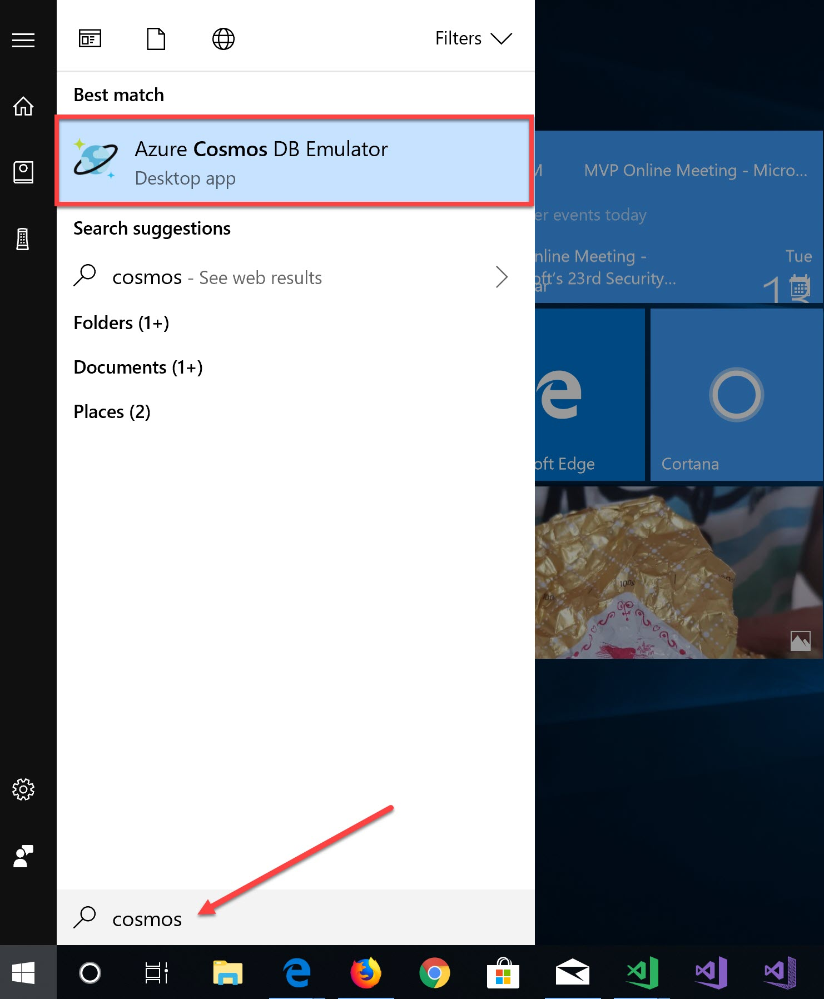
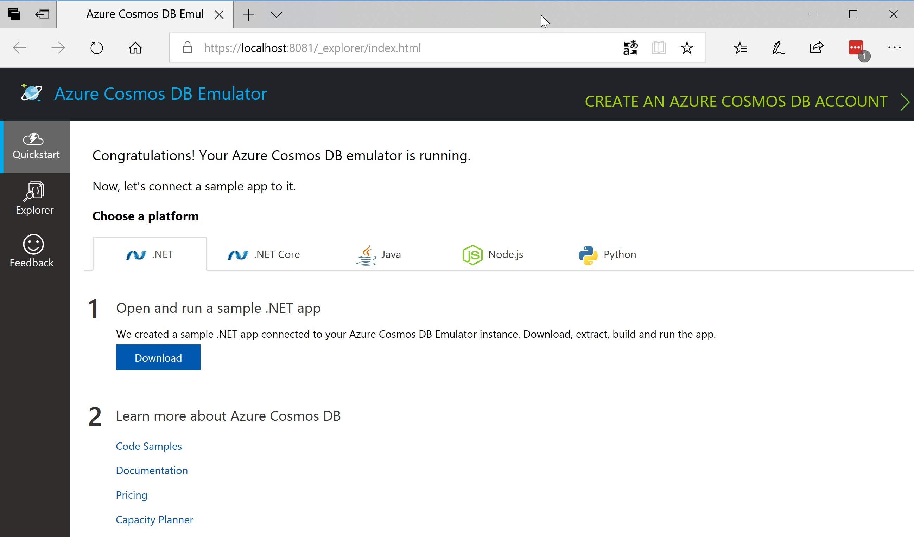
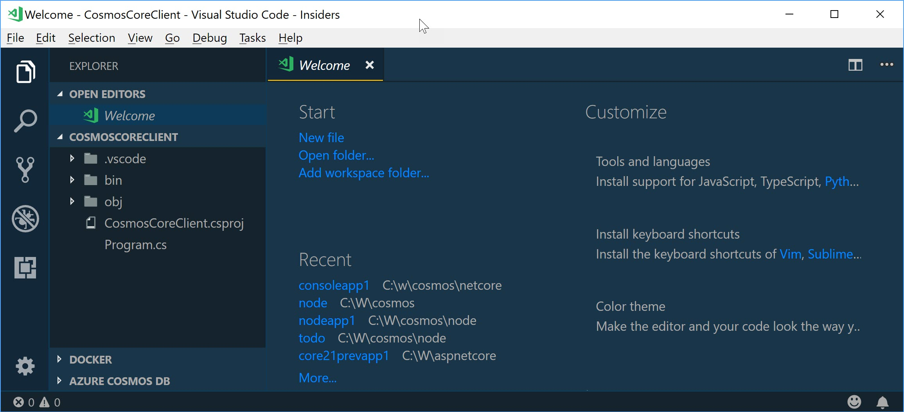
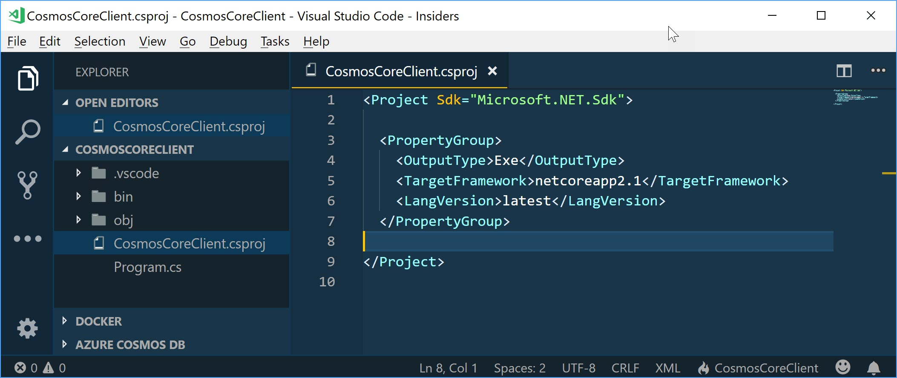
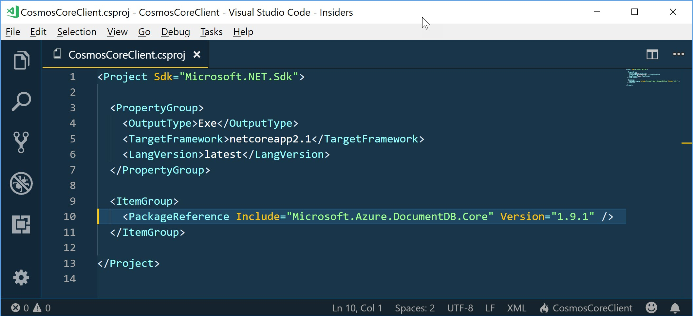
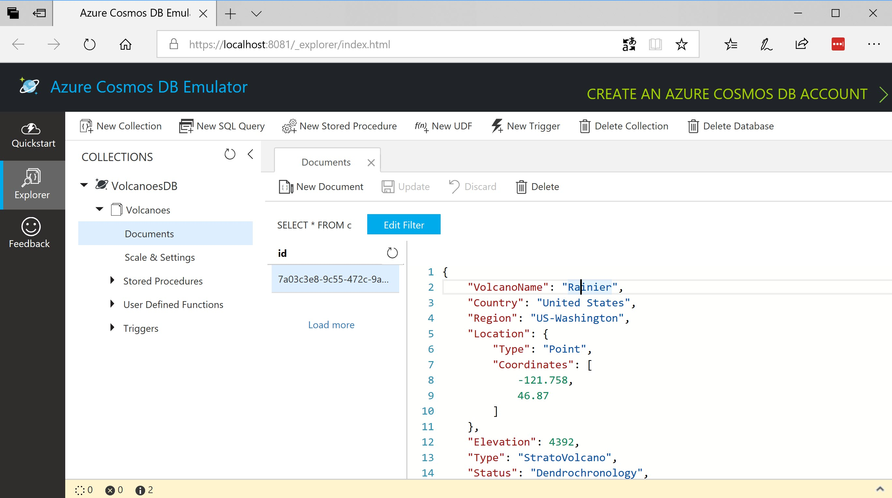

## Pre-requisites:
For this exercise, i am using the following set up on my laptop:
- Windows 10 OS
- Visual Studio Code editor with C# plugin
- .NET Core 2.1 Preview 1
- Azure Cosmos DB Emulator
Hope you have set up the above pre requisites and ready to dive in.

## Start Cosmos DB Local Emulator:
First thing i did was to start my Cosmos DB local emulator. Once installed, you can easily find Emulator by going to your Windows start screen and typing Cosmos. The Emulator should be listed in the search, click on it and the emulator will start up the local instance.



You should see a browser window open with the URL https://localhost:8081. That’s the local instance of Cosmos DB with what’s called as Data Explorer. Here is how it should look at your end too:



## Create .NET Core Console App:
To keep it simple, i will be creating a dotnet core console app and work with Cosmos DB in this console app. With dotnet core, one the great thing that has happened is – we now have a CLI for dotnet core. So lets create a new app with the below steps:
- Open a command prompt (or pwershell or whatever terminal you use on your windows)
- Navigate to a folder where you want create the app.
- Type the following command
<pre>dotnet new console -n CosmosCoreClient -o CosmosCoreClient</pre>
here -n denotes the app name, and -o tells the CLI to create a folder with that name and create the application inside the folder
- Open the newly created project in Visual Studio Code. Launch VS Code and use “Open Folder” to open the project. Here is a screenshot of how it should look on your end: 



- Now, i will be using C# 7.1 feature to create a async Main method in my console app. For that, we will need to tweak our project file a little. Open CosmosCoreClient.csproj file to edit. Add the following XML node to PropertyGroup node.
<pre><LangVersion>latest</LangVersion></pre>
After changes, your csproj file should look like below:



We are now ready to rock and roll with Cosmos DB in .NET Core application.
## Add Cosmos DB Nuget Package:
Now that we have the application created, we need to reference Cosmos DB nuget package to get the client libraries. These client libraries make it easy to work with the Cosmos DB as a backend. So lets add the nuget package to our console app.
- Open a command prompt and navigate to root of your project
- Execute the following command
<pre>dotnet add package Microsoft.Azure.DocumentDB.Core</pre>
Note: DocumetDB is where the whole journey started and hence the name sticks in Cosmos world too. Don’t worry about that for now. Lets say DocumentDB & CosmosDB are synonyms for now.
If you open the project file now a package reference would have been added. Here is a screenshot of my project file:



## Async Main Method:
Since we have configured our editor to use the latest language version, we can now have an asynchronous main method in our console app. Here is the code snippet of our main method:

```csharp
class Program
{
    static async Task Main(string[] args)
    {
        //Create Client

        //Create Database

        //Create Collection

        //Create Document(s)

        //Query Document

        //Delete Database
    }
}
```

## Volcanoes Database:
Cosmos DB has a query playground here https://www.documentdb.com/sql/demo. This is a sandboxed environment with couple of databases and you can play around with different queries you can write against the database. One of the datasets is that of Volcanoes around the world. For this post, lets create the Volcanoes database locally. Here is the data model i will use in our application:

```csharp
public class Volcano

{

    public string VolcanoName { get; set; }

    public string Country { get; set; }

    public string Region { get; set; }

    public Location Location { get; set; }

    public int Elevation { get; set; }

    public string Type { get; set; }

    public string Status { get; set; }

    public string LastEruption { get; set; }

}
```

```csharp
public class Location

{

    public string Type { get; set; }

    public double[] Coordinates { get; set; }

}
```

## Creating Client:
First up, we will need to instantiate the cosmos db client before we do anything with the database. In order to connect to the local instance of the cosmos db, we will need to know 2 things – URL of the cosmos db instane & auth key needed to authenticate. When you start the cosmos db local emulator, the db instance is available at https://localhost:8081. The auth key for local emulator is a static key and you can find it here in this article https://docs.microsoft.com/en-us/azure/cosmos-db/local-emulator#authenticating-requests. This key works only with the local emulator and wont work with your Azure instance. Here is the code snippet to instantiate the client:

```csharp
string endpointUri = "https://localhost:8081";

string authKey = "<auth key>";

string dbName = "VolcanoesDB";

string collectionName = "Volcanoes";

using (DocumentClient client = new DocumentClient(new Uri(endpointUri), authKey))

{

  //...

}
```

Make sure to add namespace Microsoft.Azure.Documents.Client to your using block.

## Creating Database:
To create a new database programmatically, we make use of CreateDatabaseAsync() or CreateDatabaseIfNotExistsAsync(). When creating the database we pass the database name. Here is the code snippet:

```csharp
//Create Database

var database = await client.CreateDatabaseIfNotExistsAsync(

                new Database { Id = dbName });
```

Make sure to import namespace Microsoft.Azure.Documents in your using block.

## Creating Collection:
Once the database is created, we can then create a collection. We make use of CreateDocumentCollectionAsync() or CreateDocumentCollectionIfNotExistsAsync(). We will need to provide what is known as the database link (basically the URI at which the db can be reached) and the collection name to the create method. Here is the code snippet:

```csharp
//Create Collection

var collection = await client.CreateDocumentCollectionIfNotExistsAsync(

                      UriFactory.CreateDatabaseUri(dbName),

                      new DocumentCollection { Id = collectionName }

                  );
```

Notice the use of UriFactory helper class. It has all sorts of helper methods which can generate the right URI links to database resources. In this snipper we use it to create the database link.

## Creating Document:
After creating the database and collection, we can now create the documents. We make use of CreateDocumentAsync() for this purpose. We will need to pass the URI of the collection under which we want to create the document and the document data itself. In this example we make use of the Volcano data mode i showed earlier and pass it to the create method. Here is the code snippet:

```csharp
//create document

var volcano = new Volcano

              {

                  VolcanoName = "Rainier",

                  Country = "United States",

                  Region = "US-Washington",

                  Location = new Location

                  {

                      Type = "Point",

                      Coordinates = new double[] { -121.758, 46.87 }

                  },

                  Elevation = 4392,

                  Type = "StratoVolcano",

                  Status = "Dendrochronology",

                  LastEruption = "Last known eruption from 1800-1899, inclusive"

              };


var document = await client.CreateDocumentAsync(

                     UriFactory.CreateDocumentCollectionUri(dbName,collectionName)

                     ,volcano);
```

## Querying Document:
Now that we have created a document, we can see how to query it. We can make use of CreateDocumentQuery() method for this purpose. We will need to pass the collection link on which we need to query. We can then build the query as a LINQ expression and the client library does the rest. This is the best part of the client library. It has the ability to translate your LINQ expression to cosmos REST URIs without me having to crack my head in constructing those URIs. Here is the code snippet:

```csharp
//Query Document

Volcano rainierVolcano = client.CreateDocumentQuery<Volcano>(

                         UriFactory.CreateDocumentCollectionUri(dbName,collectionName))

                         .Where(v => v.VolcanoName == "Rainier")

                         .AsEnumerable()

                         .FirstOrDefault();       
```

Note that you will need to import System.Linq for the LINQ expression to work.

## Deleting Database:
Lastly, we can make use of DeleteDatabaseAsync() method to delete the database programmatically. We will need to provide the database link to the delete method. We can use the UriFactory.CreateDatabaseUri() helper method to create the database link. Here is the code snippet:

```csharp
await client.DeleteDatabaseAsync(UriFactory.CreateDatabaseUri(dbName));
```

And here is how my Cosmos DB Local Data Explorer looks like now:

