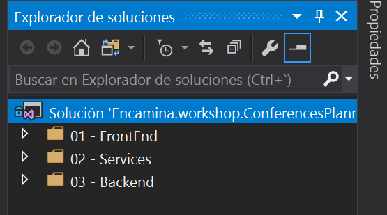
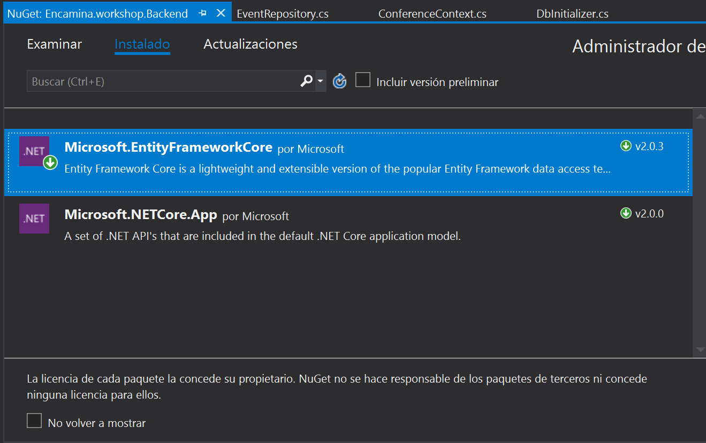

   
## Creando la solución
1. Empezaremos creando la siguiente estructura de carpetas como se ve en el ejemplo
	
   > ***Note:* NOTAS **
   > 1. (01 - Frontend) - Para alojar la web
   > 2. (02 - Services) - Para alojar nuestra capa de lógica
   > 3. (03 - Backend)  - Repositorios y acceso a datos
   


2. Crear la solución en Visual studio con el nombre `NombreAlumno.Workshop.ConferencesWeb`
3. Crearemos una blioteca de clase con el nombre `NombreAlumno.workshop.Backend`
   

## Capa de backend - Modelos de datos para la web
1. Crearemos dentro de una carpeta Models las siguientes clases
2. Clase `BaseModel`
```csharp
using System;
using System.Collections.Generic;
using System.Text;

namespace Encamina.workshop.Backend.Models
{
    public class BaseModel
    {
        public int ID { get; set; }
    }
}
```
3. Clase `Event`
```csharp
using System;
using System.Collections.Generic;
using System.Text;

namespace Encamina.workshop.Backend.Models
{
    public class Event : BaseModel
    {
        public string Name { get; set; }
        public DateTime DateEvent { get; set; }
        public string Organizer { get; set; }
        public ICollection<Session> Sessions { get; set; }
    }
}
```
4. Clase `Session`
```csharp
using System;
using System.Collections.Generic;
using System.Text;

namespace Encamina.workshop.Backend.Models
{
    public class Session : BaseModel
    {
        public string Title { get; set; }
        public int ConferenceId { get; set;}
        public string Description { get; set; }
        public int Level { get; set; }
        public int SpeakerId { get; set; }
        public Speaker Speaker { get; set; }
        public int EventId { get; set; }
        public Event Event { get; set; }
    }
}
```
5. Clase `Speaker`

```csharp
using System;
using System.Collections.Generic;
using System.ComponentModel.DataAnnotations;
using System.Text;

namespace Encamina.workshop.Backend.Models
{
 
    public class Speaker : BaseModel
    {
        [Required]
        public string Name { get; set; }
        [Required]
        public string Bio { get; set; }
        public string Twitter { get; set; }
        public string Mail { get; set; }
        public string Photo { get; set; }
        public ICollection<Session> Sessions { get; set; }
    }
}
```

## Entity Framework y contexto de base de datos

1. Instalar en el proyecto de backend el paquete nuget EntityFramework para .Net Core



2. Creamos la clase `ConferenceContext.cs` en el proyecto de backend

```csharp
using Encamina.workshop.Backend.Models;
using Microsoft.EntityFrameworkCore;
using System;

namespace Encamina.workshop.Backend
{
    public class ConferenceContext : DbContext
    {
        public DbSet<Event> Events { get; set; }
        public DbSet<Session> Sessions { get; set; }
        public DbSet<Speaker> Speakers { get; set; }

        public ConferenceContext(DbContextOptions<ConferenceContext> options) : base(options)
        {

        }
    }
}
```
3. Creamos una clase `DbInitializer.cs` para iniciar la base de datos en momento de ejecución
```csharp
using System;
using System.Collections.Generic;
using System.Text;

namespace Encamina.workshop.Backend
{
    public static class DbInitializer
    {
        public static void Initialize(ConferenceContext context)
        {
            context.Database.EnsureCreated();
        }
    }
}
```


