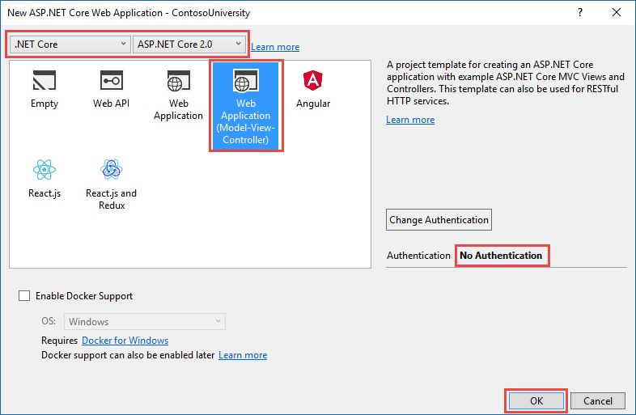

## Creación del proyecto web

1. Creamos un proyeto del tipo Web Asp.Net Core 2.0
2. Seleccionamos una plantilla WebApplication (Model-View-Controller)



## Registrar el contexto de base de datos en la aplicación
1. Actualizamos la clase `Startup.cs`para inyectar el contexto
```csharp

    public void ConfigureServices(IServiceCollection services)
        {
            services.AddMvc();
            services.AddDbContext<ConferenceContext>(options =>
      options.UseSqlServer(Configuration.GetConnectionString("DefaultConnection")));

        }

```
2. Actualizamos `program.cs`para poder inicializar la base de datos
```csharp
 public static void Main(string[] args)
        {
            var host = BuildWebHost(args);

            using (var scope = host.Services.CreateScope())
            {
                var services = scope.ServiceProvider;
                try
                {
                    var context = services.GetRequiredService<ConferenceContext>();
                    DbInitializer.Initialize(context);
                }
                catch (Exception ex)
                {
                    var logger = services.GetRequiredService<ILogger<Program>>();
                    logger.LogError(ex, "An error occurred while seeding the database.");
                }
            }

            host.Run();
        }

```
3. Añadimos la cadena de conexión a una base de datos local en `appsettings.json`
```json

{
  "ConnectionStrings": {
    "DefaultConnection": "Server=(localdb)\\mssqllocaldb;Database=ConferencesWeb;Trusted_Connection=True;MultipleActiveResultSets=true"
  },
  "Logging": {
    "IncludeScopes": false,
    "LogLevel": {
      "Default": "Warning"
    }
  }
}

```

## Creación de las vistas y los controladores con scaffolding

1. Crearemos vistas y controller para Events,Sessions y Speakers
2. Para ellos debemos seguir los siguientes pasos:
	> 1. Sobre la carpeta controller seleccionamos añadir nuevo controlador
	> 2. Seleccionamos la opción controlador desde Entity Framework
	> 3. Deberemos para el caso de Events seleccionar el modelo de origen Event, y el contexto de base de datos ConferenceContext
	> 4. El nombre del controlador lo llamaremos EventController
	> 5. Deberemos repetir estos pasos anteriores para cada modelo de base de datos

3. Si todo ha ido de forma correcta obtendremos un controller y un CRUD en vistas (Create,detail,update,delete)


## Editar la vistas y estilos

1. Este punto es totalmente libre, por defecto podriamos adapatar las vistas de la siguiente manera de ejemplo

>/shared/_layouts
```charp
<!DOCTYPE html>
<html>
<head>
    <meta charset="utf-8" />
    <meta name="viewport" content="width=device-width, initial-scale=1.0" />
    <title>@ViewData["Title"] - Buscador de eventos</title>

    <environment include="Development">
        <link rel="stylesheet" href="~/lib/bootstrap/dist/css/bootstrap.css" />
        <link rel="stylesheet" href="~/css/site.css" />
    </environment>
    <environment exclude="Development">
        <link rel="stylesheet" href="https://ajax.aspnetcdn.com/ajax/bootstrap/3.3.7/css/bootstrap.min.css"
              asp-fallback-href="~/lib/bootstrap/dist/css/bootstrap.min.css"
              asp-fallback-test-class="sr-only" asp-fallback-test-property="position" asp-fallback-test-value="absolute" />
        <link rel="stylesheet" href="~/css/site.min.css" asp-append-version="true" />
    </environment>
</head>
<body>
    <nav class="navbar navbar-inverse navbar-fixed-top">
        <div class="container">
            <div class="navbar-header">
                <button type="button" class="navbar-toggle" data-toggle="collapse" data-target=".navbar-collapse">
                    <span class="sr-only">Toggle navigation</span>
                    <span class="icon-bar"></span>
                    <span class="icon-bar"></span>
                    <span class="icon-bar"></span>
                </button>
                <a asp-area="" asp-controller="Home" asp-action="Index" class="navbar-brand">Portal de conferencias</a>
            </div>
            <div class="navbar-collapse collapse">
                <ul class="nav navbar-nav">
                    <li><a asp-area="" asp-controller="Event" asp-action="Index">Eventos</a></li>
                    <li><a asp-area="" asp-controller="Sessions" asp-action="Index">Sesiones</a></li>
                    <li><a asp-area="" asp-controller="Speakers" asp-action="Index">Ponentes</a></li>
                </ul>
            </div>
        </div>
    </nav>
    <div class="container body-content">
        @RenderBody()
        <hr />
        <footer>
            <p>&copy; 2018 - Portal de conferencias</p>
        </footer>
    </div>

    <environment include="Development">
        <script src="~/lib/jquery/dist/jquery.js"></script>
        <script src="~/lib/bootstrap/dist/js/bootstrap.js"></script>
        <script src="~/js/site.js" asp-append-version="true"></script>
    </environment>
    <environment exclude="Development">
        <script src="https://ajax.aspnetcdn.com/ajax/jquery/jquery-2.2.0.min.js"
                asp-fallback-src="~/lib/jquery/dist/jquery.min.js"
                asp-fallback-test="window.jQuery"
                crossorigin="anonymous"
                integrity="sha384-K+ctZQ+LL8q6tP7I94W+qzQsfRV2a+AfHIi9k8z8l9ggpc8X+Ytst4yBo/hH+8Fk">
        </script>
        <script src="https://ajax.aspnetcdn.com/ajax/bootstrap/3.3.7/bootstrap.min.js"
                asp-fallback-src="~/lib/bootstrap/dist/js/bootstrap.min.js"
                asp-fallback-test="window.jQuery && window.jQuery.fn && window.jQuery.fn.modal"
                crossorigin="anonymous"
                integrity="sha384-Tc5IQib027qvyjSMfHjOMaLkfuWVxZxUPnCJA7l2mCWNIpG9mGCD8wGNIcPD7Txa">
        </script>
        <script src="~/js/site.min.js" asp-append-version="true"></script>
    </environment>

    @RenderSection("Scripts", required: false)
</body>
</html>

```

>/Home/Index
```csharp
@{
    ViewData["Title"] = "Home Page";
}

<div class="jumbotron">
    <h1>Portal de eventos</h1>
</div>
<div class="row">
    <div class="col-md-8">
        <h2>Busca el evento que quieras visitar</h2>
        <p>
            Hay multitud de eventos en la comunidad .Net, no te puedes perder ninguno!!!
        </p>
        <div class="list-group">
                <a asp-area="" class="list-group-item list-group-item-action" asp-controller="Event" asp-action="Index">Eventos</a>
                <a asp-area="" class="list-group-item list-group-item-action" asp-controller="Sessions" asp-action="Index">Sesiones</a>
                <a asp-area="" class="list-group-item list-group-item-action" asp-controller="Speakers" asp-action="Index">Ponentes</a>
        </div>
    </div>
</div>

```

>Event/Details (Añadimos un listado de sesiones por evento)
```csharp

@model Encamina.workshop.Backend.Models.Event
@{
    ViewData["Title"] = "Details";
}
<h2>Details</h2>
<div>
    <h4>Event</h4>
    <hr />
    <dl class="dl-horizontal">
        <dt>
            @Html.DisplayNameFor(model => model.Name)
        </dt>
        <dd>
            @Html.DisplayFor(model => model.Name)
        </dd>
        <dt>
            @Html.DisplayNameFor(model => model.DateEvent)
        </dt>
        <dd>
            @Html.DisplayFor(model => model.DateEvent)
        </dd>
        <dt>
            @Html.DisplayNameFor(model => model.Organizer)
        </dt>
        <dd>
            @Html.DisplayFor(model => model.Organizer)
        </dd>
    </dl>
    <table class="table">
        <thead>
            <tr>
                <th>
                    Sesion
                </th>
                <th>
                    Nivel
                </th>
                <th>
                    Ponente
                </th>
            </tr>
            @foreach (var item in Model.Sessions)
            { 
                <tr>
                    <td>
                        @Html.DisplayFor(modelItem => item.Title)
                    </td>
                    <td>
                        @Html.DisplayFor(modelItem =>item.Level)
                    </td>
                </tr>
             }
            </thead>
            <tbody>
        </table>
    </div>
    <div>
        <a asp-action="Edit" asp-route-id="@Model.ID">Edit</a> |
        <a asp-action="Index">Back to List</a>
    </div>


```

> Events/Index

```csharp
@model IEnumerable<Encamina.workshop.Backend.Models.Event>

@{
    ViewData["Title"] = "Index";
}

<div class="row">
    <div class="col-md-8">
        <h1 class="page-header">Busca el evento que quieras visitar</h1>
        <p>
            Hay multitud de eventos en la comunidad .Net, no te puedes perder ninguno!!!
        </p>
        <div style="margin-top:20px;">    
            <p class="text-right">
                <a asp-action="Create" type="button" class="btn btn-primary right">+</a>
            </p>
            <table class="table">
                <thead>
                    <tr>
                        <th>
                            @Html.DisplayNameFor(model => model.Name)
                        </th>
                        <th>
                            @Html.DisplayNameFor(model => model.DateEvent)
                        </th>
                        <th>
                            @Html.DisplayNameFor(model => model.Organizer)
                        </th>
                        <th></th>
                    </tr>
                </thead>
                <tbody>
                    @foreach (var item in Model)
                    {
                        <tr>
                            <td>
                                @Html.DisplayFor(modelItem => item.Name)
                            </td>
                            <td>
                                @Html.DisplayFor(modelItem => item.DateEvent)
                            </td>
                            <td>
                                @Html.DisplayFor(modelItem => item.Organizer)
                            </td>
                            <td>
                                <a  asp-action="Edit" class="btn btn-success" asp-route-id="@item.ID">Edit</a>
                                <a  asp-action="Details" class="btn btn-info" asp-route-id="@item.ID">Details</a> 
                                <a asp-action="Delete" class="btn btn-danger" asp-route-id="@item.ID">Delete</a>
                            </td>
                        </tr>
                    }
                </tbody>
            </table>
        </div>
    </div>
</div>


```

## Editando errores básicos

1. Vista creación de una sesión, el desplegable speaker y un evento es erroneo

> Sustituir este código
```csharp
 public IActionResult Create()
        {
            ViewData["EventId"] = new SelectList(_context.Events, "ID", "Name");
            ViewData["SpeakerId"] = new SelectList(_context.Speakers, "ID", "BIO");
            return View();
        }
```

> Por este nuevo 
```csharp
 public IActionResult Create()
        {
            ViewData["EventId"] = new SelectList(_context.Events, "ID", "Name");
            ViewData["SpeakerId"] = new SelectList(_context.Speakers, "ID", "Name");
            return View();
        }
```

2. Hay más es cuestion de buscar, pista ¿Que hacemos con el campo foto?. Este os lo dejo a vosotros


   
   


